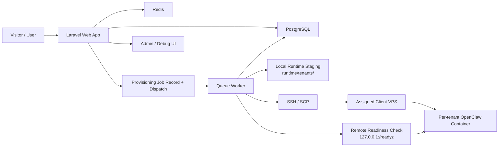
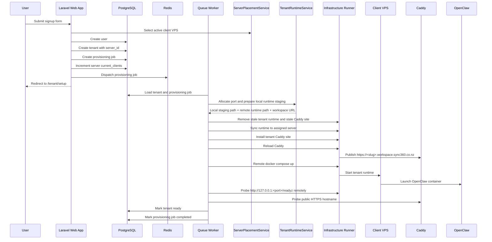

# Sync360 Control App Architecture

This document describes the current as-built architecture of the Sync360 Control App on the `codex/control-app-prod-deploy` branch.

It focuses on the implemented system, including the new VPS-ready provisioning model.

## 1. Purpose

Sync360 Control App is a Laravel-based control plane for a future multi-tenant AI service platform.

It currently validates this end-to-end flow:

1. A visitor lands on the marketing site.
2. The visitor signs up for a free trial.
3. The app creates a user, tenant, and provisioning job.
4. The app assigns the tenant to a client server.
5. A queue worker provisions the tenant asynchronously.
6. The tenant becomes `ready`.
7. The user sees a workspace-ready screen with a generated workspace URL.
8. The app can send a workspace-created email with login details after successful provisioning.
9. The app provisions a dedicated LiteLLM virtual key for each OpenClaw tenant before container startup.
10. A super admin can inspect tenants, jobs, workspace state, and trigger safe control-plane deployments.

## 2. Deployment Shapes

The codebase now supports two infrastructure shapes.

### 2.1 Local Development Shape

Used for local development and iterative design work.

Services:

- `app`
- `worker`
- `postgres`
- `redis`

In this mode:

- the Laravel app and worker run locally in Docker Compose
- the worker can talk to the local Docker host
- tenant OpenClaw containers run on the same machine

### 2.2 VPS-Ready Shape

Used for the intended primary-server plus client-VPS deployment model.

In this mode:

- Laravel app and queue worker run on the primary control server
- each tenant is assigned to a `Server` record
- tenant runtime files are generated on the control server
- runtime files are copied to the assigned client VPS over SSH
- Docker Compose is executed remotely on that client VPS over SSH
- readiness is probed remotely against the client VPS loopback interface
- workspace URLs are generated from the assigned server configuration

### 2.3 Current Deployment Architecture

The deployment architecture now has a validated first-production shape:

- control plane URL: `app.sync360.co.nz`
- planned control plane host: `161.97.74.128`
- first client runtime VPS: `89.116.28.191`
- tenant hostname pattern: `https://<tenant-slug>.workspace.sync360.co.nz`
- wildcard DNS: `*.workspace.sync360.co.nz -> 89.116.28.191`

The flow currently proven in production-like form is:

- the Laravel control app runs locally
- a tenant is assigned to the seeded `sync360-client-vps-1` server record
- provisioning uses password-auth SSH to connect as `deploy@89.116.28.191`
- runtime files are staged locally, copied to the client VPS, and started there with remote Docker Compose
- Caddy on the client VPS serves the tenant hostname over HTTPS
- the worker marks the tenant `ready` only after both remote loopback readiness and public hostname readiness succeed

This same architecture is intended to be reused after the control app is moved from local development to `161.97.74.128`.

### 2.4 Production Control-Plane Packaging

The repository now also includes a production deployment package for the control app itself.

That package consists of:

- [docker-compose.prod.yml](/Users/gayanhewage/Projects/openclaw-saas/docker-compose.prod.yml)
- a production image target in [Dockerfile](/Users/gayanhewage/Projects/openclaw-saas/Dockerfile)
- [docker/start-prod-app.sh](/Users/gayanhewage/Projects/openclaw-saas/docker/start-prod-app.sh)
- [docker/start-prod-worker.sh](/Users/gayanhewage/Projects/openclaw-saas/docker/start-prod-worker.sh)
- [deploy/apache/app.sync360.co.nz.conf](/Users/gayanhewage/Projects/openclaw-saas/deploy/apache/app.sync360.co.nz.conf)

The intended deployment shape is:

- `161.97.74.128` runs the Dockerized control plane
- Apache on the host terminates TLS for `app.sync360.co.nz`
- Apache reverse proxies to the app container on `127.0.0.1:8000`
- the worker still provisions client workspaces remotely over SSH using the current temporary password-auth model
- the super-admin UI can trigger a safe host-side deploy script over SSH to update the control plane itself

## 3. High-Level Architecture



## 4. Core Repository Areas

- `app/`
  - controllers, jobs, models, services, contracts, middleware, enums
- `config/`
  - application and provisioning configuration
- `database/migrations/`
  - schema changes for users, tenants, jobs, servers, and admin support
- `resources/views/`
  - Blade templates for public, auth, tenant, workspace, and admin pages
- `routes/web.php`
  - full route map
- `runtime/tenants/`
  - local runtime staging output
- `templates/tenant/`
  - template copied into tenant runtime staging directories
- `docker-compose.yml`
  - local development stack
- `docker-compose.prod.yml`
  - production control-plane stack
- `deploy/apache/`
  - Apache reverse proxy template for `app.sync360.co.nz`

## 5. Application Layers

### 5.1 Web Layer

Handled by Laravel controllers and Blade views.

Responsibilities:

- landing page
- signup and login
- customer dashboard
- tenant setup and status polling
- workspace-ready state
- placeholder workspace route
- super admin debug area
- super-admin control-plane deploy trigger
- super-admin live deploy status view with latest commit metadata and recent log tail

### 5.2 Queue Layer

Handled by Laravel queues backed by Redis.

Responsibilities:

- async tenant provisioning
- status transitions
- failure handling

### 5.3 Provisioning Layer

Handled through the `TenantProvisioner` contract.

Implementations:

- `App\Services\OpenClawProvisioner`
- `App\Services\LocalTenantProvisioningService`
- `App\Services\LiteLlmTenantKeyService`

### 5.4 Infrastructure Layer

Handled through the `DockerComposeRunner` contract.

Implementations:

- `App\Services\LocalDockerComposeRunner`
- `App\Services\SshDockerComposeRunner`

This layer now owns:

- runtime sync for remote servers
- Docker Compose start/stop/up/down
- remote port probing
- readiness polling

The repository also now includes a separate control-plane deployment path:

- `App\Services\ControlAppDeploymentService`
- host-side script [deploy/scripts/run-control-app-deploy.sh](/Users/gayanhewage/Projects/openclaw-saas/deploy/scripts/run-control-app-deploy.sh)

That path is intentionally separate from tenant provisioning:

- it targets the primary control server, not a client VPS
- it triggers a detached host-side deploy script over SSH
- it reads back a deploy status file, latest deployed git commit metadata, and recent log tail for the super-admin UI
- it exposes a lightweight authenticated status endpoint that the admin page polls every few seconds for realtime updates
- it hardens deploy status reads so admin pages keep working even when deploy secrets are missing or partially configured
- it treats the host-side deploy status file as the authoritative record of the commit that was actually fetched and deployed, rather than inferring that commit later from a fresh git lookup
- it is intentionally separated from the tenant provisioning runner contract so the control plane does not need direct self-Docker control inside Laravel

## 6. Route Architecture

Defined in [routes/web.php](/Users/gayanhewage/Projects/openclaw-saas/routes/web.php).

### Public Routes

- `/`
- `/signup`
- `/login`

### Authenticated Customer Routes

- `POST /logout`
- `/dashboard`
- `/tenant/setup`
- `/tenant/status`
- `/tenant/workspace-ready`
- `/workspace/{tenant:slug}`

### Admin Routes

- `/admin`
- `/admin/users`
- `/admin/tenants`
- `/admin/jobs`
- `GET /admin/deploy/control-app/status`
- `POST /admin/deploy/control-app`
- `POST /admin/jobs/{tenant}/retry`
- `POST /admin/tenants/{tenant}/workspace/start`
- `POST /admin/tenants/{tenant}/workspace/stop`

Admin routes are protected by:

- `auth`
- `admin`
- optional `local.only`, controlled by config

## 7. Authentication And Admin Model

Authentication is intentionally small and session-based.

Implemented behavior:

- register
- login
- logout
- session persistence
- guest-only auth pages
- admin-only access to operational routes
- trusted reverse-proxy support through the `TRUSTED_PROXIES` environment variable

Admin control:

- `users.is_admin` gates super-admin access
- super admins without a tenant are redirected to `/admin`
- non-admins receive `403`

## 8. Data Model

### 8.1 Users

Purpose:

- authentication identity
- owner of a tenant
- optional super admin

Important fields:

- `id`
- `name`
- `email`
- `password`
- `phone`
- `is_admin`

### 8.2 Tenants

Purpose:

- represent a provisioned customer workspace

Important fields:

- `id`
- `tenant_id`
- `slug`
- `business_name`
- `industry`
- `skill_pack`
- `user_id`
- `server_id`
- `trial_status`
- `provisioning_status`
- `assigned_port`
- `workspace_url`
- `runtime_path`
- `litellm_virtual_key`
- `litellm_key_alias`
- `litellm_plan_name`
- `litellm_max_budget`
- `litellm_budget_duration`
- `litellm_last_synced_at`

### 8.3 ProvisioningJobs

Purpose:

- record each provisioning attempt and its result
- temporarily carry encrypted workspace-ready email credentials until a successful email send

Important fields:

- `id`
- `tenant_id`
- `job_type`
- `status`
- `payload_json`
- `error_message`
- `started_at`
- `completed_at`

`payload_json` is also used for transient provisioning metadata such as:

- signup context
- retry context
- encrypted initial password for the workspace-created email
- workspace-ready email sent timestamp

### 8.4 Servers

Purpose:

- describe where tenant workspaces are deployed

Important fields:

- `id`
- `name`
- `host`
- `ssh_host`
- `ssh_port`
- `ssh_user`
- `ssh_private_key_path`
- `ssh_auth_mode`
- `ssh_password_env_key`
- `sudo_password_env_key`
- `status`
- `max_clients`
- `current_clients`
- `runtime_root`
- `workspace_scheme`
- `workspace_base_domain`
- `docker_compose_bin`
- `caddy_sites_path`
- `caddy_reload_command`

The seeded super admin is now environment-driven:

- `SYNC360_SUPER_ADMIN_NAME`
- `SYNC360_SUPER_ADMIN_EMAIL`
- `SYNC360_SUPER_ADMIN_PASSWORD`
- `SYNC360_RESET_SUPER_ADMIN_PASSWORD`

Behavior:

- first seed creates the super admin
- later seeds preserve the existing password by default
- password reset only happens when `SYNC360_RESET_SUPER_ADMIN_PASSWORD=true`

### 8.5 Relationships

- `User` has one `Tenant`
- `Tenant` belongs to `User`
- `Tenant` belongs to `Server`
- `Tenant` has many `ProvisioningJob`
- `ProvisioningJob` belongs to `Tenant`
- `Server` has many `Tenant`

## 9. Status Enums

### Tenant Provisioning Status

- `pending`
- `provisioning`
- `ready`
- `failed`

### Trial Status

- `trial_active`
- `trial_expired`

### Provisioning Job Status

- `queued`
- `running`
- `completed`
- `failed`

## 10. Signup And Tenant Creation Flow

Signup is handled in [app/Http/Controllers/Auth/RegisterController.php](/Users/gayanhewage/Projects/openclaw-saas/app/Http/Controllers/Auth/RegisterController.php).

Form fields:

- `business_name`
- `contact_name`
- `email`
- `password`
- `password_confirmation`
- `industry`
- `skill_pack`
- optional `phone`

On successful signup:

1. Validate the request.
2. Select an active server using `ServerPlacementService`.
3. Create the `User`.
4. Create the `Tenant` with `server_id`.
5. Create a queued `ProvisioningJob`.
6. Store workspace-ready email metadata in the job payload, including the login email and encrypted initial password.
7. Increment the selected server’s `current_clients`.
8. Log the user in.
9. Dispatch `ProcessTenantProvisioning`.
10. Redirect to `/tenant/setup`.

If no client VPS is available, signup fails cleanly with a validation-style error instead of a `500`.

## 11. Queue Flow

Entry job:

- [app/Jobs/ProcessTenantProvisioning.php](/Users/gayanhewage/Projects/openclaw-saas/app/Jobs/ProcessTenantProvisioning.php)

Responsibilities:

- load tenant and provisioning job
- resolve the active `TenantProvisioner`
- call `provision($tenant, $provisioningJob)`
- send the workspace-created email after successful provisioning when Brevo is enabled
- mark tenant and job failed if provisioning throws

The queue job does not mark a ready tenant as failed if the post-provisioning email send fails. Email failures are logged separately so provisioning success remains authoritative.

## 12. Provisioning Architecture

### 12.1 Contract

- [app/Contracts/TenantProvisioner.php](/Users/gayanhewage/Projects/openclaw-saas/app/Contracts/TenantProvisioner.php)

### 12.2 Runtime Preparation

Shared runtime work is handled by:

- [app/Services/TenantRuntimeService.php](/Users/gayanhewage/Projects/openclaw-saas/app/Services/TenantRuntimeService.php)

Responsibilities:

- allocate next free port for the assigned server
- generate server-aware workspace URL
- create local runtime staging path
- copy template files
- create required directories
- write tenant `.env`
- write `metadata.json`
- compute remote runtime path from the assigned server

### 12.3 Local Fake Provisioner

- [app/Services/LocalTenantProvisioningService.php](/Users/gayanhewage/Projects/openclaw-saas/app/Services/LocalTenantProvisioningService.php)

Purpose:

- lightweight fake provisioning
- used in tests or local simplified scenarios

### 12.4 OpenClaw Provisioner

- [app/Services/OpenClawProvisioner.php](/Users/gayanhewage/Projects/openclaw-saas/app/Services/OpenClawProvisioner.php)

Current provisioning sequence:

1. Mark tenant `provisioning`.
2. Mark provisioning job `running`.
3. Allocate a free port for the assigned server.
4. Generate workspace URL.
5. Generate or reuse the tenant's dedicated LiteLLM virtual key.
6. Persist the encrypted LiteLLM key plus plan and budget metadata on the tenant record.
7. Generate local runtime staging files, including `OPENAI_API_KEY` and `OPENAI_BASE_URL`.
8. Compute remote runtime path for the assigned server.
9. Write `config/openclaw.json`.
10. Write `compose.yaml` using the remote runtime bind path and tenant-scoped LiteLLM environment.
11. Write a tenant-specific `workspace.caddy` site fragment when wildcard-domain routing is configured.
12. Persist `assigned_port`, `runtime_path`, and `workspace_url`.
13. Stop any stale remote tenant runtime and remove any stale tenant Caddy file.
14. Sync local runtime staging to the assigned server over SSH when using SSH infrastructure.
15. Install the tenant Caddy site file on the client VPS and reload Caddy.
16. Start the OpenClaw container on the target host.
17. Poll the loopback readiness endpoint on the client VPS.
18. Poll the public HTTPS workspace hostname.
19. Mark tenant `ready`.
20. Mark provisioning job `completed`.
21. Trigger the workspace-created email service after successful provisioning.

On failure:

- stale runtime is cleaned up as best effort
- stale tenant Caddy site files are removed as best effort
- tenant startup is aborted if LiteLLM key generation fails
- tenant becomes `failed`
- provisioning job becomes `failed`
- `error_message` is stored

Email-specific behavior:

- the workspace-created email is sent only after the tenant is already ready
- the initial password is stored encrypted in the provisioning job payload
- after a successful send, the encrypted password is removed from the payload and a sent timestamp is stored
- if the email provider call fails, the tenant remains `ready` and the failure is logged

### 12.5 Workspace-Created Email

- [app/Services/WorkspaceReadyEmailService.php](/Users/gayanhewage/Projects/openclaw-saas/app/Services/WorkspaceReadyEmailService.php)

Purpose:

- send the customer-facing confirmation that the workspace has been created
- include workspace link, username, and initial password
- keep initial credentials encrypted at rest until the email is sent successfully

Current provider:

- Brevo transactional email API via `POST /v3/smtp/email`

Configuration:

- `BREVO_ENABLED`
- `BREVO_API_KEY`
- `BREVO_BASE_URL`
- `BREVO_SENDER_EMAIL` or `MAIL_FROM_ADDRESS`
- `BREVO_SENDER_NAME` or `MAIL_FROM_NAME`

Operational behavior:

- email is skipped entirely if Brevo is not enabled or not configured
- the sender address should be a verified Brevo sender
- retry provisioning can carry forward the encrypted credentials so a tenant still receives the email after a retry succeeds

### 12.6 LiteLLM Virtual Key Provisioning

- [app/Services/LiteLlmTenantKeyService.php](/Users/gayanhewage/Projects/openclaw-saas/app/Services/LiteLlmTenantKeyService.php)

Purpose:

- create one dedicated LiteLLM virtual key per tenant
- inject that key into the OpenClaw runtime before container startup
- prevent OpenClaw instances from starting without tenant-scoped API credentials
- support later budget updates, suspension, and deletion without sharing keys across tenants

Configuration:

- `LITELLM_BASE_URL`
- `LITELLM_MASTER_KEY`
- `LITELLM_DEFAULT_PLAN_NAME`
- `LITELLM_DEFAULT_MAX_BUDGET`
- `LITELLM_DEFAULT_BUDGET_DURATION`
- `LITELLM_TRIAL_MAX_BUDGET`

Operational behavior:

- the service calls `POST /key/generate` on LiteLLM before OpenClaw runtime preparation
- the generated tenant key is stored on the tenant record with Laravel encrypted casting
- the generated runtime `.env` file receives `OPENAI_API_KEY` and `OPENAI_BASE_URL`
- the tenant `compose.yaml` also receives `OPENAI_API_KEY` and `OPENAI_BASE_URL` so the OpenClaw container uses the tenant key at runtime
- if LiteLLM key generation fails, provisioning aborts immediately and the tenant instance is not started
- plan changes use `POST /key/update`
- suspension uses `POST /key/update` with `max_budget=0` and `budget_duration=null`
- cancellation-ready cleanup uses `POST /key/delete`

## 12.7 Control-Plane Deploy Status Flow

The control-plane deploy feature now has a dedicated status loop for the super-admin interface.

Implemented behavior:

- the admin panel triggers a detached host-side deploy script over SSH
- the host-side script writes a status file and append-only deploy log on the control server
- that status file records the branch, timestamps, message, and the exact fetched-and-deployed commit SHA and subject after `git pull`
- the Laravel app reads those files over SSH through `ControlAppDeploymentService`
- the service prefers the status-file commit metadata and only falls back to a direct git lookup when the status file does not exist yet
- the service also compares the deployed commit with the current `origin/<branch>` tip on the primary server repository to determine whether production is already up to date
- the admin page polls `GET /admin/deploy/control-app/status` every few seconds
- the UI updates deploy state, started/finished timestamps, message, latest commit, up-to-date state, and recent log tail without a full page refresh

Shell hardening now includes:

- remote deploy commands are sent directly to SSH without an extra nested `sh -lc` wrapper
- deploy status probe statements are separated with semicolons for portable remote shell parsing
- deploy UI actions are derived from the deployed-vs-branch commit comparison: `Up-to-date` when hashes match, otherwise `Fetch Latest And Deploy`
- misconfigured deploy secrets or unreachable SSH targets surface as a readable failed/unreachable state instead of taking `/admin` down with a `500`

## 13. Infrastructure Runner Architecture

### 13.1 Contract

- [app/Contracts/DockerComposeRunner.php](/Users/gayanhewage/Projects/openclaw-saas/app/Contracts/DockerComposeRunner.php)

Responsibilities:

- sync runtime files to a target server
- run Docker Compose commands
- probe server port usage
- check readiness

### 13.2 Local Runner

- [app/Services/LocalDockerComposeRunner.php](/Users/gayanhewage/Projects/openclaw-saas/app/Services/LocalDockerComposeRunner.php)

Used when:

- `SYNC360_INFRASTRUCTURE_DRIVER=local`

Behavior:

- no runtime sync step
- uses local Docker Compose
- checks readiness locally

### 13.3 SSH Runner

- [app/Services/SshDockerComposeRunner.php](/Users/gayanhewage/Projects/openclaw-saas/app/Services/SshDockerComposeRunner.php)

Used when:

- `SYNC360_INFRASTRUCTURE_DRIVER=ssh`

Behavior:

- creates remote runtime directory over SSH
- copies runtime staging to the assigned client VPS over SCP
- supports both key-based auth and temporary password-based auth via `sshpass`
- resolves SSH and sudo passwords from env-only secret keys referenced by the `Server` record
- uploads or removes remote files such as tenant Caddy site configs
- runs privileged remote commands through `sudo -S` when needed
- runs Docker Compose remotely over SSH
- probes ports remotely using `ss`
- checks readiness remotely using `curl`

## 14. Runtime Filesystem Model

### 14.1 Local Staging Path

Generated under:

```text
runtime/tenants/<tenant-slug>/
```

Contents:

```text
.env
metadata.json
compose.yaml
config/
  openclaw.json
data/
logs/
workspace/
```

### 14.2 Remote Runtime Path

Derived from the assigned server:

```text
<server.runtime_root>/tenants/<tenant-slug>/
```

The database `runtime_path` now stores the remote runtime path, not the local staging path.

### 14.3 Client VPS Filesystem Roles

For the validated client-VPS shape on `89.116.28.191`:

- tenant runtimes live under `/srv/sync360/runtime/tenants/<slug>/`
- tenant Caddy site files live under `/etc/caddy/sites/<slug>.caddy`
- Caddy imports `/etc/caddy/sites/*.caddy` from the main Caddyfile

This means the provisioning system owns both:

- the tenant runtime directory
- the reverse-proxy route definition for the tenant hostname

## 15. Workspace URL Model

Workspace URLs are generated from the assigned `Server`.

Rules:

```text
if workspace_base_domain is present:
  <scheme>://<tenant-slug>.<workspace_base_domain>

otherwise:
  <scheme>://<server.host>:<assigned_port>
```

This supports:

- wildcard subdomain routing such as `tenant.workspace.sync360.co.nz`
- host-and-port routing during infrastructure testing

In the current validated deployment model:

- `workspace_scheme = https`
- `workspace_base_domain = workspace.sync360.co.nz`
- URLs therefore resolve to `https://<tenant-slug>.workspace.sync360.co.nz`

The internal placeholder route still exists:

```text
/workspace/{tenant:slug}
```

## 16. Admin And Operational Controls

Handled in:

- [app/Http/Controllers/AdminController.php](/Users/gayanhewage/Projects/openclaw-saas/app/Http/Controllers/AdminController.php)

Capabilities:

- admin overview
- users list
- tenants list
- jobs list
- retry failed provisioning
- start remote tenant workspace
- stop remote tenant workspace
- inspect workspace state
- inspect client VPS assignment
- inspect runtime paths and workspace URLs
- inspect provisioning errors

## 17. Configuration Surface

Primary configuration file:

- [config/sync360.php](/Users/gayanhewage/Projects/openclaw-saas/config/sync360.php)

Important groups:

- `admin_local_only`
- `infrastructure.driver`
- SSH timeout settings
- SSH/SCP/sshpass binary settings
- local runtime root
- template root
- port range
- provisioning driver
- OpenClaw image and compose config
- public workspace readiness polling

Default environment values live in:

- [.env.example](/Users/gayanhewage/Projects/openclaw-saas/.env.example)

Important deployment env keys now include:

- `SYNC360_INFRASTRUCTURE_DRIVER=ssh`
- `SYNC360_CLIENT_VPS_SSH_PASSWORD`
- `SYNC360_CLIENT_VPS_SUDO_PASSWORD`
- `SYNC360_DEFAULT_SERVER_SSH_AUTH_MODE=password`
- `SYNC360_DEFAULT_SERVER_SSH_PASSWORD_ENV_KEY`
- `SYNC360_DEFAULT_SERVER_SUDO_PASSWORD_ENV_KEY`
- `SYNC360_DEFAULT_SERVER_CADDY_SITES_PATH`
- `SYNC360_DEFAULT_SERVER_CADDY_RELOAD_COMMAND`

These secrets are intentionally env-only and are not stored in git or in the database.

## 18. Docker Compose Development Stack

Defined in [docker-compose.yml](/Users/gayanhewage/Projects/openclaw-saas/docker-compose.yml).

Local services:

- `app`
- `worker`
- `postgres`
- `redis`

The local stack still mounts the Docker socket so local infrastructure mode continues to work in development.

## 19. Client VPS Bootstrap Flow

The app now includes a one-time bootstrap command for preparing a fresh client VPS:

- command: `php artisan sync360:bootstrap-client-vps {serverSelector?}`

Current bootstrap responsibilities:

- install Caddy using the official apt repository when it is missing
- create `/srv/sync360/runtime` and `/srv/sync360/runtime/tenants`
- create `/etc/caddy/sites`
- ensure the `deploy` user can work with the runtime directories
- add `import /etc/caddy/sites/*.caddy` to the main Caddyfile if needed
- enable and reload Caddy
- verify remote `docker compose` availability

This command is part of the deployment architecture because provisioning assumes the target server already has:

- Docker installed
- Caddy installed and enabled
- the runtime root available
- tenant site import support enabled in Caddy

## 20. Seed Data

Seeding creates:

- the default super admin user
- the default server record based on environment variables

Default admin:

- email: `admin@sync360.local`
- password: `admin12345`

## 21. Request And Provisioning Sequence



## 22. Deployment Topology

### 22.1 Control Plane

Intended production endpoint:

- `https://app.sync360.co.nz`

Intended production host:

- `161.97.74.128`

Responsibilities:

- Laravel web app
- queue worker
- PostgreSQL
- Redis
- tenant signup and admin/debug UI
- tenant placement and remote provisioning orchestration

### 22.2 Client Runtime Plane

Validated first runtime host:

- `89.116.28.191`

Responsibilities:

- tenant runtime directory root
- per-tenant OpenClaw containers
- Caddy reverse proxy
- public HTTPS termination for `*.workspace.sync360.co.nz`

### 22.3 Trust And Secret Model

Current validated access model:

- remote access user: `deploy`
- transport: password-auth SSH
- privilege escalation: passworded `sudo`
- password lookup: env-only secrets on the control-plane worker

This is explicitly temporary. The next hardening step is:

- replace password auth with SSH keys
- update the `Server` record to use `ssh_auth_mode=key`
- remove password env keys from the worker environment

## 23. Test Coverage

Current feature coverage includes:

- landing page CTA rendering
- signup creation of user, tenant, server assignment, and job
- duplicate email validation
- graceful signup failure when no client VPS is available
- local provisioning success
- OpenClaw provisioning success
- OpenClaw readiness failure handling
- runtime file generation
- admin access restrictions
- admin retry flow
- admin workspace controls
 - password-auth SSH runner behavior
 - public hostname readiness failure handling

## 24. Architectural Strengths

- standard Laravel structure
- queue-driven provisioning
- clean separation between web, provisioning, and infrastructure concerns
- server-aware tenant placement
- local and SSH infrastructure modes behind one contract
- staging runtime generation isolated in one service
- OpenClaw provisioning isolated behind one provisioner
- admin visibility into provisioning and workspace state
 - validated remote deployment path to a real client VPS

## 25. Current Architectural Limits

The app is now VPS-ready at the control-plane level, but some operational concerns are still external or intentionally lightweight.

### 25.1 DNS Automation Is External

The app now automates tenant Caddy route installation and reloads on the client VPS, but it still does not automate:

- wildcard DNS creation
- DNS record updates across providers

Caddy can obtain and serve TLS automatically once DNS is already pointing to the client VPS.

### 25.2 Server Scheduling Is Basic

Current server selection is intentionally simple:

- active server only
- least-loaded by `current_clients`
- hard capacity check against `max_clients`

It does not yet support:

- health-based failover
- draining or maintenance windows
- regional placement
- auto-rebalancing

### 25.3 Password Auth Is Temporary

The current validated deployment uses password-auth SSH plus `sudo -S`.

That is appropriate for controlled staged testing, but not the final hardened production posture.

The next security step is key-based SSH with restricted sudo policy.

### 25.4 Long First Pulls Are Expected

The first OpenClaw deployment to a fresh client VPS can take several minutes because the `ghcr.io/openclaw/openclaw:latest` image is large.

The runner now uses the longer OpenClaw compose timeout to accommodate that first pull.

## 26. Summary

Today’s Sync360 Control App is:

- a Laravel control-plane MVP
- queue-driven
- Blade-based
- PostgreSQL-backed for state
- Redis-backed for async provisioning
- capable of assigning tenants to client VPS servers
- capable of provisioning OpenClaw containers locally or remotely over SSH
- capable of generating server-aware workspace URLs
- equipped with super-admin inspection and workspace control tools
- able to bootstrap and provision the first client VPS deployment architecture

It is now ready for the intended primary-server plus client-VPS deployment architecture at the application layer, with DNS automation, SSH key hardening, and broader production hardening left as the next operational steps.
