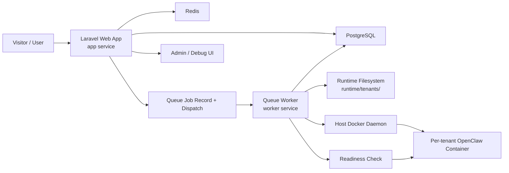
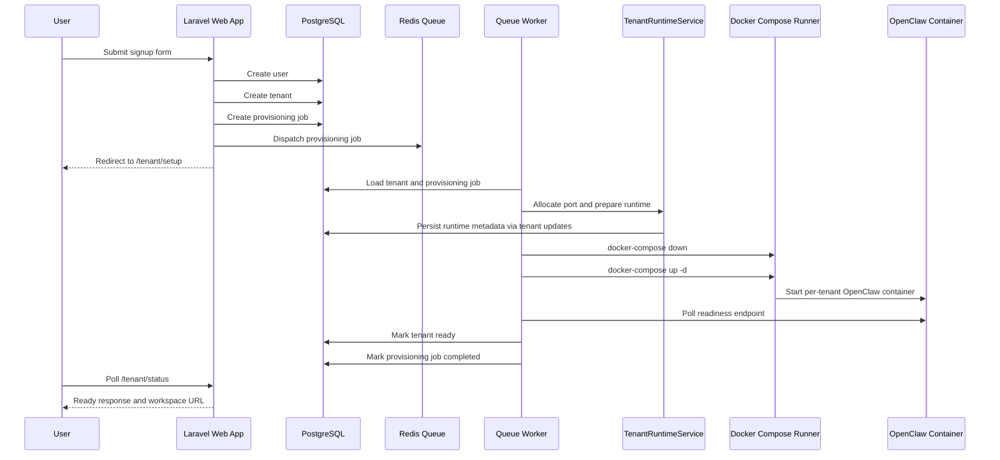

# Sync360 Control App Architecture

This document describes the current architecture of the Sync360 Control App as it exists today in this repository.

It is intentionally focused on the implemented system, not the desired future production platform.

## 1. Purpose

Sync360 Control App is a Laravel-based control-plane MVP for a future multi-tenant AI service platform.

The current application proves this workflow end to end:

1. A visitor lands on the marketing site.
2. The visitor signs up for a free trial.
3. The app creates a user, tenant, and provisioning job.
4. A queue worker provisions a tenant runtime asynchronously.
5. The tenant is marked ready when provisioning succeeds.
6. The user sees a workspace-ready experience with a generated workspace URL.
7. A super admin can inspect tenants, jobs, and workspace state from the local admin area.

The codebase currently supports both:

- a simple fake local provisioner for tests and fallback scenarios
- a Stage 2 OpenClaw provisioner that launches one OpenClaw gateway container per tenant

## 2. Current Deployment Model

The system is currently designed and validated for local development on a single machine using Docker Compose.

Current local runtime services:

- `app`: Laravel web application
- `worker`: Laravel queue worker
- `postgres`: primary database
- `redis`: queue backend

In Stage 2, the `worker` service also controls the host Docker daemon through `/var/run/docker.sock` and starts one tenant-specific OpenClaw container per provisioned tenant.

This means the current system behaves like a local control plane and local tenant host combined into one environment.

It is not yet a true remote multi-server architecture.

## 3. High-Level Architecture



## 4. Repository Structure

Important top-level areas:

- `app/`
  - controllers, models, jobs, enums, services, contracts, middleware
- `config/`
  - environment-driven app configuration including tenant provisioning settings
- `database/migrations/`
  - schema definitions for users, tenants, jobs, servers, and admin flag
- `resources/views/`
  - Blade templates for landing page, auth, dashboard, tenant setup, ready screens, admin pages, and workspace placeholder
- `routes/web.php`
  - all web routes
- `runtime/tenants/`
  - generated tenant runtime directories
- `templates/tenant/`
  - source template used to scaffold tenant runtime folders
- `docker-compose.yml`
  - local runtime topology
- `Dockerfile`
  - PHP image used for both `app` and `worker`
- `docker/start-app.sh`
  - startup flow for the web app container
- `docker/start-worker.sh`
  - startup flow for the queue worker container

## 5. Application Layers

### 5.1 Web Layer

The web layer is handled by Laravel controllers and Blade views.

Primary responsibilities:

- marketing and public routes
- signup and login
- authenticated customer dashboard
- tenant setup progress polling
- workspace-ready screen
- internal placeholder workspace
- admin and debug pages

### 5.2 Domain Layer

The domain logic is intentionally lightweight and centered around:

- `User`
- `Tenant`
- `ProvisioningJob`
- `Server`

Provisioning behavior is abstracted behind contracts and services rather than being embedded in controllers.

### 5.3 Queue Layer

Provisioning happens asynchronously through Laravel queues backed by Redis.

Web requests only create records and dispatch jobs.
The worker owns actual provisioning execution and failure handling.

### 5.4 Runtime Provisioning Layer

Tenant provisioning logic is isolated behind the `TenantProvisioner` contract.

Current provisioner implementations:

- `App\Services\OpenClawProvisioner`
- `App\Services\LocalTenantProvisioningService`

Shared runtime scaffolding is handled by:

- `App\Services\TenantRuntimeService`

### 5.5 Docker Control Layer

Docker runtime commands are abstracted behind:

- `App\Contracts\DockerComposeRunner`

Current implementation:

- `App\Services\LocalDockerComposeRunner`

This is a key seam for future replacement with SSH-based or remote orchestration.

## 6. Route Architecture

Defined in [routes/web.php](/Users/gayanhewage/Projects/openclaw-saas/routes/web.php).

### 6.1 Public Routes

- `/`
- `/signup`
- `/login`

### 6.2 Authenticated Customer Routes

- `POST /logout`
- `/dashboard`
- `/tenant/setup`
- `/tenant/status`
- `/tenant/workspace-ready`
- `/workspace/{tenant:slug}`

### 6.3 Admin Routes

Protected by:

- `auth`
- `local.only`
- `admin`

Admin routes:

- `/admin`
- `/admin/users`
- `/admin/tenants`
- `/admin/jobs`
- `POST /admin/jobs/{tenant}/retry`
- `POST /admin/tenants/{tenant}/workspace/start`
- `POST /admin/tenants/{tenant}/workspace/stop`

## 7. Authentication Model

Authentication is custom but intentionally minimal.

Implemented behavior:

- session-based login
- session persistence
- logout
- guest-only signup and login pages
- authenticated customer routes
- super-admin flag on users

Primary files:

- [app/Http/Controllers/Auth/LoginController.php](/Users/gayanhewage/Projects/openclaw-saas/app/Http/Controllers/Auth/LoginController.php)
- [app/Http/Controllers/Auth/RegisterController.php](/Users/gayanhewage/Projects/openclaw-saas/app/Http/Controllers/Auth/RegisterController.php)
- [app/Http/Middleware/EnsureAdminUser.php](/Users/gayanhewage/Projects/openclaw-saas/app/Http/Middleware/EnsureAdminUser.php)

Admin behavior:

- `users.is_admin` controls super-admin access
- super admins without a tenant are redirected to `/admin`
- non-admin users are blocked from admin routes with `403`

## 8. Data Model

### 8.1 Users

Primary responsibility:

- authentication identity
- account owner for a tenant
- optional super admin

Important fields:

- `id`
- `name`
- `email`
- `password`
- `phone`
- `is_admin`
- timestamps

### 8.2 Tenants

Primary responsibility:

- represent a customer workspace being provisioned and operated

Important fields:

- `id`
- `tenant_id`
- `slug`
- `business_name`
- `industry`
- `skill_pack`
- `user_id`
- `trial_status`
- `provisioning_status`
- `assigned_port`
- `workspace_url`
- `runtime_path`
- timestamps

Important behaviors:

- one user owns one tenant in the MVP
- `tenant_id` is the external identifier
- `slug` is used in runtime paths and placeholder workspace routes

### 8.3 ProvisioningJobs

Primary responsibility:

- record all tenant provisioning attempts and outcomes

Important fields:

- `id`
- `tenant_id`
- `job_type`
- `status`
- `payload_json`
- `error_message`
- `started_at`
- `completed_at`
- timestamps

### 8.4 Servers

Primary responsibility:

- future use for server targeting

Current behavior:

- one default local record is seeded
- not yet used to assign tenants to specific infrastructure

### 8.5 Relationships

- `User` has one `Tenant`
- `Tenant` belongs to `User`
- `Tenant` has many `ProvisioningJob`
- `ProvisioningJob` belongs to `Tenant`

## 9. Enums and Status Modeling

### 9.1 Tenant Provisioning Status

Defined in [app/Enums/TenantProvisioningStatus.php](/Users/gayanhewage/Projects/openclaw-saas/app/Enums/TenantProvisioningStatus.php).

Values:

- `pending`
- `provisioning`
- `ready`
- `failed`

### 9.2 Trial Status

Defined in [app/Enums/TrialStatus.php](/Users/gayanhewage/Projects/openclaw-saas/app/Enums/TrialStatus.php).

Values:

- `trial_active`
- `trial_expired`

### 9.3 Provisioning Job Status

Defined in [app/Enums/ProvisioningJobStatus.php](/Users/gayanhewage/Projects/openclaw-saas/app/Enums/ProvisioningJobStatus.php).

Values:

- `queued`
- `running`
- `completed`
- `failed`

## 10. Signup and Tenant Creation Flow

Signup is handled in [app/Http/Controllers/Auth/RegisterController.php](/Users/gayanhewage/Projects/openclaw-saas/app/Http/Controllers/Auth/RegisterController.php).

Form fields:

- `business_name`
- `contact_name`
- `email`
- `password`
- `password_confirmation`
- `industry`
- `skill_pack`
- optional `phone`

On successful signup:

1. Validate request.
2. Start a DB transaction.
3. Create the `User`.
4. Create the `Tenant`.
5. Set `trial_status = trial_active`.
6. Set `provisioning_status = pending`.
7. Create a `ProvisioningJob` with `job_type = provision_tenant` and `status = queued`.
8. Commit transaction.
9. Log the user in.
10. Dispatch `ProcessTenantProvisioning`.
11. Redirect to `/tenant/setup`.

## 11. Queue and Job Flow

The queue entrypoint is:

- [app/Jobs/ProcessTenantProvisioning.php](/Users/gayanhewage/Projects/openclaw-saas/app/Jobs/ProcessTenantProvisioning.php)

The job does not directly implement infrastructure logic.
Instead it:

1. Loads the tenant and provisioning job records.
2. Resolves the active `TenantProvisioner`.
3. Calls `provision($tenant, $provisioningJob)`.
4. Marks the tenant and job failed if an exception escapes.

This separation keeps web requests small and makes provisioning swappable.

## 12. Provisioning Architecture

### 12.1 Contract

Provisioning is abstracted by:

- [app/Contracts/TenantProvisioner.php](/Users/gayanhewage/Projects/openclaw-saas/app/Contracts/TenantProvisioner.php)

### 12.2 Runtime Service

Shared runtime preparation is handled by:

- [app/Services/TenantRuntimeService.php](/Users/gayanhewage/Projects/openclaw-saas/app/Services/TenantRuntimeService.php)

Responsibilities:

- allocate the next free tenant port
- compute current workspace URL
- prepare tenant runtime path
- copy the tenant template
- create required directories
- write tenant `.env`
- write tenant `metadata.json`
- translate container paths to host paths for Docker bind mounts

### 12.3 Local Fake Provisioner

- [app/Services/LocalTenantProvisioningService.php](/Users/gayanhewage/Projects/openclaw-saas/app/Services/LocalTenantProvisioningService.php)

Purpose:

- lightweight fake provisioning
- primarily used for tests or simple fallback scenarios

Behavior:

- marks job running
- sleeps for configured fake delay
- allocates port
- prepares runtime files
- marks tenant ready
- marks job completed

### 12.4 OpenClaw Provisioner

- [app/Services/OpenClawProvisioner.php](/Users/gayanhewage/Projects/openclaw-saas/app/Services/OpenClawProvisioner.php)

Purpose:

- launch one OpenClaw gateway container per tenant

Behavior:

1. Mark tenant as `provisioning`.
2. Mark job as `running`.
3. Allocate or reuse `assigned_port`.
4. Generate workspace URL.
5. Generate tenant runtime.
6. Write `config/openclaw.json`.
7. Write tenant `compose.yaml`.
8. Persist `assigned_port`, `runtime_path`, and `workspace_url`.
9. Stop any stale runtime for the tenant.
10. Start the tenant runtime through Docker Compose.
11. Poll readiness endpoint.
12. Mark tenant `ready`.
13. Mark job `completed`.

On failure:

- attempt cleanup with `docker-compose down`
- rethrow to the queue job
- queue job marks tenant `failed`
- queue job marks provisioning job `failed`
- store error message

## 13. Docker Runtime Control

The Docker control seam is:

- [app/Contracts/DockerComposeRunner.php](/Users/gayanhewage/Projects/openclaw-saas/app/Contracts/DockerComposeRunner.php)

Current implementation:

- [app/Services/LocalDockerComposeRunner.php](/Users/gayanhewage/Projects/openclaw-saas/app/Services/LocalDockerComposeRunner.php)

Supported operations:

- `up`
- `down`
- `start`
- `stop`
- `isRunning`
- `isHostPortInUse`

Current implementation details:

- uses `docker-compose`
- executes locally from the Laravel environment
- assumes access to the Docker socket
- probes ports using a configured host

This is explicitly local-host oriented and is not yet remote-server orchestration.

## 14. Runtime Filesystem Layout

Each tenant runtime is generated under:

```text
runtime/tenants/<tenant-slug>/
```

The runtime contains:

```text
.env
metadata.json
compose.yaml
config/
  openclaw.json
data/
logs/
workspace/
```

Template source:

```text
templates/tenant/
```

Runtime generation is destructive and recreates the tenant runtime path on reprovision.

## 15. Workspace URL Model

Current workspace URLs are generated from the assigned port:

```text
http://localhost:<assigned_port>
```

This is suitable for local architecture validation only.

The customer-facing app also exposes an internal placeholder route:

```text
/workspace/{tenant:slug}
```

That route allows a fully clickable local MVP even when the true public tenant runtime model is not yet implemented.

## 16. Admin and Super Admin Architecture

Admin functionality is handled in:

- [app/Http/Controllers/AdminController.php](/Users/gayanhewage/Projects/openclaw-saas/app/Http/Controllers/AdminController.php)

Current admin capabilities:

- dashboard overview
- list users
- list tenants
- list provisioning jobs
- inspect latest provisioning state
- see assigned ports
- see workspace URLs
- see runtime paths
- see error messages
- retry tenant provisioning
- start a provisioned workspace
- stop a provisioned workspace

Admin dashboard metrics include:

- total users
- total tenants
- queued jobs
- running jobs
- completed jobs
- failed jobs
- pending tenants
- ready tenants
- failed tenants

Current access model:

- authenticated user required
- must be local environment
- must have `is_admin = true`

## 17. Current UI Architecture

The UI is Blade-first.

Key view areas:

- public landing page
- login and signup flows
- customer dashboard
- tenant setup/progress page with polling
- workspace-ready page
- placeholder workspace view
- admin views

Important layouts:

- guest layout for public/auth pages
- app/admin layouts for authenticated areas

Recent UI work includes:

- Sprint 3 customer-facing dashboard cleanup
- Sprint 4 landing redesign
- login/signup visual cleanup
- workspace-style hero product preview

## 18. Docker Compose Topology

Current local Docker topology is defined in [docker-compose.yml](/Users/gayanhewage/Projects/openclaw-saas/docker-compose.yml).

### 18.1 app

Responsibilities:

- serve Laravel web app
- run migrations and seed startup dependencies when needed
- expose app on port `8000`
- mount project source
- mount Docker socket for admin workspace start/stop controls

### 18.2 worker

Responsibilities:

- run `php artisan queue:work redis`
- execute tenant provisioning jobs
- mount project source
- mount Docker socket for tenant runtime orchestration

### 18.3 postgres

Responsibilities:

- persistent relational storage

### 18.4 redis

Responsibilities:

- queue transport

## 19. Service Boot Process

Container startup scripts perform environment bootstrap tasks such as:

- waiting for database and Redis
- installing PHP dependencies if needed
- running migrations
- seeding initial records
- starting the appropriate service role

This keeps first-run setup simple in local development.

## 20. Seed Data

Current seed behavior includes:

- default `Server` record for local development
- default super admin user

Default super admin credentials:

- email: `admin@sync360.local`
- password: `admin12345`

## 21. Configuration Surface

Provisioning behavior is controlled in [config/sync360.php](/Users/gayanhewage/Projects/openclaw-saas/config/sync360.php).

Important configuration groups:

- host project root mapping
- host port probe settings
- tenant runtime root
- tenant template root
- tenant port range
- active provisioning driver
- fake delay
- OpenClaw image and service names
- compose filename
- OpenClaw internal port
- readiness path
- readiness probe host
- readiness timeout
- compose command timeout

Local defaults live in [.env.example](/Users/gayanhewage/Projects/openclaw-saas/.env.example).

## 22. Request and Provisioning Sequence



## 23. Test Coverage

Current test suite covers:

- landing page CTA rendering
- signup creation of user, tenant, and provisioning job
- duplicate email validation
- local provisioning success
- OpenClaw provisioning success
- runtime file generation
- provisioning failure path
- OpenClaw readiness failure path
- setup/ready state behavior
- admin retry flow
- admin access restrictions
- admin workspace controls

## 24. Key Architectural Strengths

- standard Laravel structure
- simple and understandable control-plane flow
- provisioning isolated behind contracts
- runtime generation isolated in a dedicated service
- queue-based async provisioning
- support for both fake and real runtime provisioning paths
- admin visibility into provisioning and runtime state
- good seam for future remote orchestration work

## 25. Current Architectural Limits

The current architecture is still local-first and has important limitations.

### 25.1 Not Yet VPS-Ready

The current implementation still assumes:

- local Docker daemon access from Laravel containers
- `docker-compose` running on the same machine
- `localhost`-based tenant URLs
- local bind-mounted runtime paths
- readiness probing via local-style host assumptions

### 25.2 DNS and Reverse Proxy Not Implemented

There is no built-in support yet for:

- wildcard tenant subdomains
- server-aware workspace URL generation
- per-server reverse proxy routing
- TLS automation
- remote DNS management

### 25.3 Servers Table Not Operational Yet

The `servers` table exists, but it is not yet part of tenant scheduling or placement logic.

### 25.4 Security Model Is MVP-Level

Current admin and auth behavior is suitable for local development and staged internal testing, not final production hardening.

## 26. Planned Evolution Path

The existing seams suggest this likely next step:

1. Keep Laravel control app on a primary server.
2. Add remote server targeting through `servers`.
3. Introduce a remote Docker or SSH runner implementation.
4. Generate real public workspace URLs instead of `localhost`.
5. Route tenant traffic by hostname instead of raw ports.
6. Use a wildcard subdomain and reverse proxy for tenant workspaces.

This future work should replace the infrastructure control layer without forcing a major rewrite of the web application itself.

## 27. Summary

Today’s Sync360 Control App is:

- a Laravel control-plane MVP
- local-first
- queue-driven
- Blade-based
- Redis-backed for async provisioning
- PostgreSQL-backed for state
- capable of launching one OpenClaw gateway container per tenant on the local host
- equipped with an admin surface for inspection and local operational control

It is a solid prototype architecture for validating the tenant signup-to-provisioning loop, while still needing a dedicated remote orchestration layer before serious VPS deployment.
