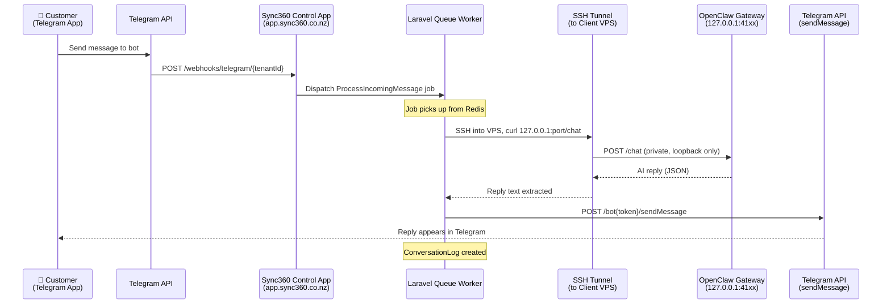
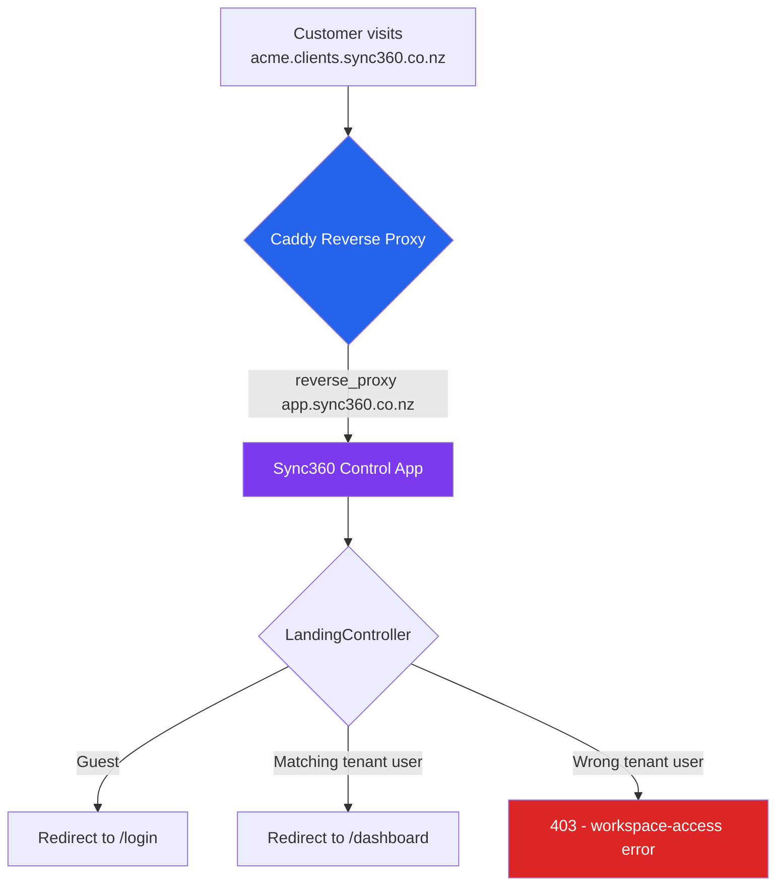

# Branch Review — `cdx-feature/tenant-workspace-login`

> [!IMPORTANT]
> Historical walkthrough. Canonical current truth is in [`artifacts/MEMORY.md`](../MEMORY.md) and [`artifacts/ARCHITECTURE.md`](../ARCHITECTURE.md). The Telegram webhook flow described below is no longer current, and WhatsApp details in older docs may reflect planned or scaffolded work rather than fully implemented behavior.

**Commits reviewed:** `d8f38af` (Route tenant workspace URLs into Sync360 and privatize gateway) + `afc6453` (Track artifact plan documents)

---

## What Changed (Summary)

This branch makes **two major architectural shifts**:

1. **Tenant workspace URLs now open the Sync360 Control App** (login / dashboard), not the raw OpenClaw gateway UI.
2. **The OpenClaw gateway is now fully private** — it binds only to `127.0.0.1:<port>` on the VPS. All access goes through SSH-tunnelled control-plane requests.

---

## End-to-End Telegram → Private OpenClaw Flow

This is the core question — how does a Telegram message reach an OpenClaw instance that has **zero public exposure**.



### Step-by-Step Breakdown

#### 1. Telegram Webhook Arrives at Sync360

- Telegram delivers updates to a public webhook URL like:
  ```
  https://app.sync360.co.nz/webhooks/telegram/{tenantId}
  ```
- This route is exempted from CSRF verification in [bootstrap/app.php](file:///Users/gayanhewage/Projects/openclaw-saas/bootstrap/app.php).
- [WebhookController::handleTelegram()](file:///Users/gayanhewage/Projects/openclaw-saas/app/Http/Controllers/WebhookController.php#L82-L115) parses the Telegram update, extracts `text`, `message_id`, and `chat.id`.
- It checks for duplicate messages via `ConversationLog` and then dispatches a `ProcessIncomingMessage` job to the queue.

#### 2. Queue Worker Processes the Message

[ProcessIncomingMessage](file:///Users/gayanhewage/Projects/openclaw-saas/app/Jobs/ProcessIncomingMessage.php#L36-L85) runs on the Laravel queue worker:

1. **Forward to OpenClaw** via `TenantWorkspaceMessenger::send()`
2. **Send reply back to Telegram** via `TelegramSender::send()`
3. **Log the conversation** to `ConversationLog`

#### 3. Private Gateway Request (the key architectural piece)

This is where the "fully private" design comes together:

| Layer | File | What it does |
|---|---|---|
| **Messenger** | [TenantWorkspaceMessenger](file:///Users/gayanhewage/Projects/openclaw-saas/app/Services/TenantWorkspaceMessenger.php) | Calls `TenantGatewayService::request()` with the chat payload |
| **Gateway Service** | [TenantGatewayService](file:///Users/gayanhewage/Projects/openclaw-saas/app/Services/TenantGatewayService.php) | Resolves the private gateway URL (`http://127.0.0.1:<port>`) and delegates to `DockerComposeRunner::httpRequest()` |
| **Runtime Service** | [TenantRuntimeService::gatewayBaseUrl()](file:///Users/gayanhewage/Projects/openclaw-saas/app/Services/TenantRuntimeService.php#L77-L84) | Returns `http://127.0.0.1:{assigned_port}` — the loopback address on the tenant's VPS |
| **SSH Transport** | [SshDockerComposeRunner::httpRequest()](file:///Users/gayanhewage/Projects/openclaw-saas/app/Services/SshDockerComposeRunner.php#L35-L96) | SSHs into the VPS and runs a `curl` command against `127.0.0.1` from inside the server |

The `SshDockerComposeRunner::httpRequest()` method:
- Creates a temp file on the remote server
- Runs `curl -sS -X POST` with JSON payload against the **loopback URL** on the VPS
- Captures the HTTP status code and response body
- Returns them as `['status' => 200, 'body' => '...']`

> [!IMPORTANT]
> The OpenClaw container port binding is `"127.0.0.1:{port}:{internal_port}"` — it is **never** exposed to any network interface. The only way to reach it is from inside the VPS itself, which Sync360 does via SSH + curl.

#### 4. Reply Sent Back to Telegram

[TelegramSender](file:///Users/gayanhewage/Projects/openclaw-saas/app/Services/Channels/TelegramSender.php) uses the Telegram Bot API directly:
- Reads `telegram_bot_token` from the tenant's encrypted `channel_config`
- POSTs to `https://api.telegram.org/bot{token}/sendMessage`

---

## Workspace URL Routing (the other half of the branch)

Previously, a tenant's `workspace_url` (e.g. `https://acme.clients.sync360.co.nz`) pointed directly at the OpenClaw gateway UI. Now:



### Key Components

| Component | Purpose |
|---|---|
| [OpenClawProvisioner::writeCaddyConfig()](file:///Users/gayanhewage/Projects/openclaw-saas/app/Services/OpenClawProvisioner.php#L140-L160) | Generates Caddy config that `reverse_proxy`s to the **control app upstream** instead of the OpenClaw port |
| [LandingController](file:///Users/gayanhewage/Projects/openclaw-saas/app/Http/Controllers/LandingController.php) | Detects workspace subdomain visits and routes appropriately |
| [WorkspaceHostResolver](file:///Users/gayanhewage/Projects/openclaw-saas/app/Services/WorkspaceHostResolver.php) | Maps incoming hostnames like `acme.clients.sync360.co.nz` to a `Tenant` model |
| [EnsureWorkspaceTenantAccess](file:///Users/gayanhewage/Projects/openclaw-saas/app/Http/Middleware/EnsureWorkspaceTenantAccess.php) | Middleware that blocks cross-tenant access on workspace subdomains |

### OpenClaw Config: Gateway Locked Down

In [writeOpenClawConfig()](file:///Users/gayanhewage/Projects/openclaw-saas/app/Services/OpenClawProvisioner.php#L117-L138):
```json
{
  "gateway": {
    "mode": "local",
    "bind": "lan",
    "auth": { "mode": "token", "token": "..." },
    "controlUi": { "enabled": false }
  }
}
```
- `controlUi.enabled = false` — no public web UI
- `auth.mode = "token"` — token-gated API access
- Docker port binding: `127.0.0.1:PORT:18789` — loopback only

---

## Telegram Channel Configuration Flow

When a customer connects Telegram during onboarding:

1. **Customer provides bot token** in the onboarding wizard (Step 5)
2. [OnboardingController::saveChannel()](file:///Users/gayanhewage/Projects/openclaw-saas/app/Http/Controllers/OnboardingController.php) saves `channel = 'telegram'` and `channel_config = { telegram_bot_token: '...' }` (encrypted)
3. [TenantAgentSyncService::configureChannel()](file:///Users/gayanhewage/Projects/openclaw-saas/app/Services/TenantAgentSyncService.php#L96-L150):
   - Reads `openclaw.json` from the tenant's local runtime
   - Merges `channels.telegram = { enabled: true, botToken: '...', dmPolicy: 'open' }`
   - Writes back to `openclaw.json`
   - SCPs the updated config to the VPS
   - Runs `docker compose restart` on the VPS via SSH
4. Customer sets their Telegram bot webhook URL to `https://app.sync360.co.nz/webhooks/telegram/{tenantId}`

Disconnect follows the reverse path via [removeChannelConfig()](file:///Users/gayanhewage/Projects/openclaw-saas/app/Services/TenantAgentSyncService.php#L156-L198).

---

## Review Notes

### ✅ What's Good

- **Clean separation of concerns.** The gateway privatisation is layered through a contract (`DockerComposeRunner`), a gateway service, a messenger, and channel senders — each with a single responsibility.
- **SSH-only gateway access is a strong security posture.** No API keys, firewall rules, or network policies to manage — OpenClaw simply cannot be reached from the internet.
- **Idempotent duplicate protection.** Both the webhook controller and the queue job check `ConversationLog` for duplicates before processing.
- **Workspace host isolation.** The `EnsureWorkspaceTenantAccess` middleware prevents tenant A's user from loading tenant B's workspace subdomain — important for a multi-tenant SaaS.
- **Test coverage.** New `WorkspaceHostAccessTest` covers guest redirect, matching access, and cross-tenant blocking scenarios.

### ⚠️ Observations / Things to Watch

1. **Latency budget.** Each Telegram message round-trip requires: webhook → queue pickup → SSH connection → curl → AI inference → SSH response → Telegram API. The SSH overhead (~1-2s) is on top of the AI latency. Worth monitoring in production.

2. **Single point of failure on SSH.** If SSH credentials rotate or the VPS sshd goes down, all gateway communication stops. Consider adding retry logic or health-check alerting for the SSH layer itself.

3. **`TenantGatewayService` vs `TenantWorkspaceMessenger` naming.** These overlap conceptually — `Gateway` fetches from the private gateway, `Messenger` wraps it with reply extraction. The boundary is clear in code but the naming could be tighter.

4. **`ProcessIncomingMessage` has `$tries = 1`.** If the SSH connection fails transiently, the message is lost (logged with error but no retry). Consider increasing tries or adding a dead-letter mechanism.

5. **Session domain config.** The release notes mention `.sync360.co.nz` session sharing for auth across `app.sync360.co.nz` and tenant subdomains — make sure `SESSION_DOMAIN` is properly set in production `.env`.

---

## Architecture After This Branch

```
┌──────────────────────────────────────────────────────────────┐
│  Internet                                                     │
│  ┌──────────┐    ┌──────────────────────────────────────────┐ │
│  │ Telegram │    │  Customer Browser                        │ │
│  │   API    │    │  (acme.clients.sync360.co.nz)            │ │
│  └────┬─────┘    └──────────────┬───────────────────────────┘ │
│       │                         │                              │
│       ▼                         ▼                              │
│  ┌─────────────────────────────────────────────────────┐      │
│  │  Sync360 Control App (app.sync360.co.nz)             │      │
│  │  ┌─────────┐  ┌───────────┐  ┌───────────────────┐  │      │
│  │  │Webhook  │  │ Landing   │  │ Dashboard/Profile  │  │      │
│  │  │Controller│  │Controller │  │ Onboarding etc.   │  │      │
│  │  └────┬────┘  └───────────┘  └───────────────────┘  │      │
│  │       │                                              │      │
│  │       ▼                                              │      │
│  │  ┌──────────────────────────┐                        │      │
│  │  │ ProcessIncomingMessage   │ (Queue)                 │      │
│  │  │ → TenantWorkspaceMessenger                        │      │
│  │  │   → TenantGatewayService                          │      │
│  │  │     → SshDockerComposeRunner.httpRequest()        │      │
│  │  └──────────────┬───────────┘                        │      │
│  └─────────────────┼────────────────────────────────────┘      │
│                    │ SSH                                        │
│  ┌─────────────────▼───────────────────────────────────┐      │
│  │  Client VPS (89.116.28.191)                          │      │
│  │  ┌─────────────────────────────────────────────┐    │      │
│  │  │  Caddy                                       │    │      │
│  │  │  acme.clients.sync360.co.nz →                │    │      │
│  │  │    reverse_proxy app.sync360.co.nz           │    │      │
│  │  └─────────────────────────────────────────────┘    │      │
│  │  ┌─────────────────────────────────────────────┐    │      │
│  │  │  OpenClaw Container                          │    │      │
│  │  │  127.0.0.1:41xx (PRIVATE - no public access) │    │      │
│  │  │  controlUi: disabled                         │    │      │
│  │  │  auth: token-gated                           │    │      │
│  │  └─────────────────────────────────────────────┘    │      │
│  └─────────────────────────────────────────────────────┘      │
└──────────────────────────────────────────────────────────────┘
```

The OpenClaw gateway is a **black box** — it has no public surface. The customer interacts with Sync360 for management and Telegram for conversations. Sync360 is the single control plane that bridges both through SSH.
