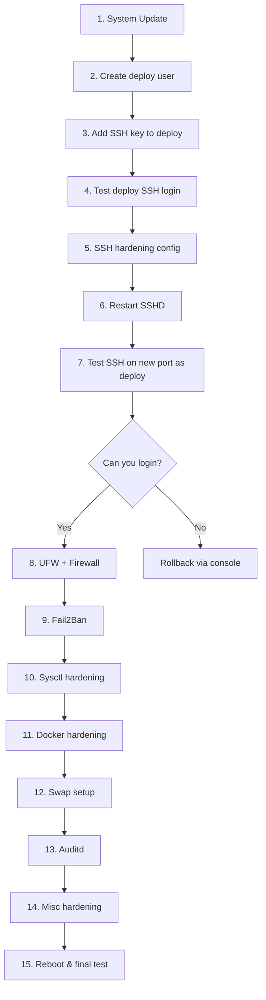

# Server Hardening Plan — Ubuntu 22.04 Docker Host

## Current State (Audit Summary)

| Area | Status | Risk |
|---|---|---|
| **OS** | Ubuntu 22.04.5 LTS, kernel 5.15.0-173 | ✅ OK |
| **Resources** | 4 vCPU, 8 GB RAM, 146 GB disk, no swap | ⚠️ No swap |
| **SSH** | Root login enabled, conflicting PasswordAuth configs (50-cloud-init says `yes`, 60-cloudimg says `no`) | 🔴 Critical |
| **Firewall (UFW)** | Inactive — INPUT policy ACCEPT (wide open) | 🔴 Critical |
| **Users** | Only root — no unprivileged admin user | 🔴 Critical |
| **fail2ban** | Not installed | 🔴 Critical |
| **Docker** | v29.4, no `daemon.json`, no log rotation, no user namespace remapping | ⚠️ Needs hardening |
| **AppArmor** | Loaded, 40 profiles enforcing | ✅ OK |
| **Unattended upgrades** | Installed and running | ✅ OK |
| **auditd / AIDE** | Not installed | ⚠️ Recommended |
| **Open ports** | Only SSH (22) exposed externally | ✅ OK for now |

---

## User Review Required

> [!IMPORTANT]
> **SSH access method**: You're currently logging in as root. The plan creates a new admin user `deploy` with sudo access. You'll need to **add your SSH public key** to this user. Are you currently using password or key-based auth to connect?

> [!WARNING]
> **SSH port change**: The plan changes SSH from port 22 to **2222**. After applying, you'll connect with `ssh -p 2222 deploy@<ip>`. If your hosting provider has a console/VNC recovery option, this is safe. **Confirm you have console access** in case of lockout.

> [!CAUTION]
> **Firewall activation**: UFW will be enabled, blocking all inbound traffic except ports 2222 (SSH), 80 (HTTP), and 443 (HTTPS). If you need other ports open (e.g., for a database, monitoring agent, or custom service), **list them now** so we don't lock you out.

---

## Proposed Changes

### Phase 1: System Updates & Admin User

#### 1.1 Full system update
- `apt update && apt full-upgrade -y`
- Reboot if kernel was updated

#### 1.2 Create unprivileged admin user `deploy`
- `adduser deploy` (with strong password or `--disabled-password`)
- `usermod -aG sudo deploy`
- Copy SSH authorized_keys to `/home/deploy/.ssh/authorized_keys`
- Verify sudo works for `deploy` user

> [!IMPORTANT]
> **Username choice**: I've chosen `deploy`. Let me know if you prefer a different name.

---

### Phase 2: SSH Hardening

#### [MODIFY] /etc/ssh/sshd_config.d/10-hardened.conf (NEW file, takes priority)

All hardening goes into a single drop-in file. Key changes:

| Setting | Value | Why |
|---|---|---|
| `Port` | `2222` | Reduces drive-by scan noise |
| `PermitRootLogin` | `no` | Force use of `deploy` + sudo |
| `PasswordAuthentication` | `no` | Key-only auth |
| `PubkeyAuthentication` | `yes` | Explicit enable |
| `AuthenticationMethods` | `publickey` | Only keys |
| `X11Forwarding` | `no` | Not needed on server |
| `MaxAuthTries` | `3` | Limit brute-force |
| `ClientAliveInterval` | `300` | Drop idle sessions |
| `ClientAliveCountMax` | `2` | After 10 min idle |
| `AllowUsers` | `deploy` | Whitelist only |
| `Protocol` | `2` | SSHv2 only |

#### [DELETE] /etc/ssh/sshd_config.d/50-cloud-init.conf
- Remove conflicting `PasswordAuthentication yes`

---

### Phase 3: Firewall (UFW)

#### Setup UFW rules
```bash
ufw default deny incoming
ufw default allow outgoing
ufw allow 2222/tcp comment 'SSH'
ufw allow 80/tcp comment 'HTTP'
ufw allow 443/tcp comment 'HTTPS'
ufw enable
```

#### Docker + UFW compatibility
Docker bypasses UFW by default via iptables manipulation. Fix by:

#### [NEW] /etc/docker/daemon.json
```json
{
  "iptables": false
}
```

> [!WARNING]
> Setting `"iptables": false` means Docker won't auto-create port forwarding rules. You'll need to manage exposed container ports via UFW rules or a reverse proxy (recommended: Traefik or Caddy in front of containers). This is actually **better for a SaaS setup** because it gives you explicit control over what's exposed.

Alternatively, we can use the **UFW-Docker** approach that adds `DOCKER-USER` chain rules without disabling Docker's iptables entirely. Let me know your preference:
- **Option A**: `"iptables": false` + explicit UFW rules per service (more secure, more manual)
- **Option B**: Keep Docker iptables + UFW-Docker rules in `DOCKER-USER` chain (easier, slightly less explicit)

---

### Phase 4: Fail2Ban

#### Install and configure
```bash
apt install fail2ban -y
```

#### [NEW] /etc/fail2ban/jail.local
```ini
[DEFAULT]
bantime = 3600
findtime = 600
maxretry = 5
banaction = ufw

[sshd]
enabled = true
port = 2222
filter = sshd
logpath = /var/log/auth.log
maxretry = 3
bantime = 86400
```

---

### Phase 5: Kernel & Network Hardening

#### [NEW] /etc/sysctl.d/99-hardened.conf
```ini
# Disable IP source routing
net.ipv4.conf.all.accept_source_route = 0
net.ipv4.conf.default.accept_source_route = 0

# Disable ICMP redirects
net.ipv4.conf.all.accept_redirects = 0
net.ipv4.conf.default.accept_redirects = 0
net.ipv4.conf.all.send_redirects = 0
net.ipv4.conf.default.send_redirects = 0
net.ipv6.conf.all.accept_redirects = 0
net.ipv6.conf.default.accept_redirects = 0

# Enable SYN flood protection
net.ipv4.tcp_syncookies = 1
net.ipv4.tcp_max_syn_backlog = 2048
net.ipv4.tcp_synack_retries = 2

# Log martian packets
net.ipv4.conf.all.log_martians = 1
net.ipv4.conf.default.log_martians = 1

# Ignore ICMP broadcasts
net.ipv4.icmp_echo_ignore_broadcasts = 1

# Enable reverse path filtering
net.ipv4.conf.all.rp_filter = 1
net.ipv4.conf.default.rp_filter = 1

# Keep IP forwarding ON (needed for Docker)
net.ipv4.ip_forward = 1

# Disable IPv6 if not needed
net.ipv6.conf.all.disable_ipv6 = 1
net.ipv6.conf.default.disable_ipv6 = 1

# Harden shared memory
kernel.randomize_va_space = 2
```

---

### Phase 6: Docker Hardening

#### [NEW] /etc/docker/daemon.json
Complete config (extends Phase 3):
```json
{
  "iptables": false,
  "log-driver": "json-file",
  "log-opts": {
    "max-size": "10m",
    "max-file": "3"
  },
  "no-new-privileges": true,
  "userns-remap": "default",
  "live-restore": true,
  "userland-proxy": false,
  "default-ulimits": {
    "nofile": {
      "Name": "nofile",
      "Hard": 65536,
      "Soft": 65536
    },
    "nproc": {
      "Name": "nproc",
      "Hard": 4096,
      "Soft": 4096
    }
  }
}
```

| Setting | Purpose |
|---|---|
| `log-opts` | Prevent disk fill from runaway container logs |
| `no-new-privileges` | Prevent privilege escalation inside containers |
| `userns-remap` | Map container root to unprivileged host UID (major isolation win) |
| `live-restore` | Containers survive Docker daemon restarts |
| `userland-proxy: false` | Use iptables instead of docker-proxy (more efficient) |

> [!IMPORTANT]
> **`userns-remap`** remaps container UIDs. Existing containers/volumes may need ownership fixes. Since this is a fresh server, this is the ideal time to enable it. If you have existing data, let me know.

---

### Phase 7: Swap & Resource Limits

#### Create 4 GB swap file
```bash
fallocate -l 4G /swapfile
chmod 600 /swapfile
mkswap /swapfile
swapon /swapfile
echo '/swapfile none swap sw 0 0' >> /etc/fstab
```

Prevents OOM kills when containers spike memory usage.

---

### Phase 8: Auditing & Monitoring

#### Install auditd
```bash
apt install auditd audispd-plugins -y
```

#### [NEW] /etc/audit/rules.d/hardened.rules
```
# Monitor file changes to critical configs
-w /etc/ssh/sshd_config -p wa -k ssh_config
-w /etc/docker/daemon.json -p wa -k docker_config
-w /etc/passwd -p wa -k passwd_changes
-w /etc/shadow -p wa -k shadow_changes
-w /etc/sudoers -p wa -k sudoers_changes

# Monitor Docker socket access
-w /var/run/docker.sock -p rwxa -k docker_socket

# Monitor container runtime
-w /usr/bin/docker -p x -k docker_commands
-w /usr/bin/containerd -p x -k containerd_commands
```

---

### Phase 9: Automatic Security Updates

Already installed (`unattended-upgrades`). Verify config:

#### [MODIFY] /etc/apt/apt.conf.d/50unattended-upgrades
- Ensure `Unattended-Upgrade::Automatic-Reboot` is set for security kernel updates
- Enable email notifications if mail relay is available

---

### Phase 10: Misc Hardening

#### 10.1 Secure shared memory
#### [MODIFY] /etc/fstab
Add:
```
tmpfs /run/shm tmpfs defaults,noexec,nosuid 0 0
```

#### 10.2 Disable unnecessary services
```bash
systemctl disable --now snapd.service snapd.socket
systemctl disable --now packagekit.service
```

#### 10.3 Set login banners
#### [NEW] /etc/issue.net
```
*******************************************************************
WARNING: This system is for authorized use only.
All connections are logged and monitored.
Unauthorized access will be prosecuted to the full extent of the law.
*******************************************************************
```

#### 10.4 Restrict cron to authorized users
```bash
echo "deploy" > /etc/cron.allow
chmod 600 /etc/cron.allow
```

---

## Execution Order (Critical — avoids lockout)



> [!CAUTION]
> Steps 2–7 are the most dangerous (SSH lockout risk). We'll keep root SSH enabled until `deploy` user is fully verified, then lock it down.

---

## Open Questions

1. **SSH port**: Is `2222` acceptable, or do you prefer a different non-standard port?
2. **Admin username**: `deploy` ok, or prefer something else?
3. **Docker iptables**: Option A (`iptables: false`) or Option B (UFW-Docker chain rules)?
4. **Do you have console/VNC access** to this server for recovery?
5. **Any additional ports** you need open beyond SSH, HTTP, HTTPS?
6. **IPv6**: Do you need IPv6 connectivity, or can we disable it?
7. **`userns-remap`**: Any existing Docker volumes/containers we need to preserve?

---

## Verification Plan

### Automated Tests
After each phase, verify:
```bash
# SSH: verify config
sshd -t                        # Config syntax check
ss -tlnp | grep 2222           # New port listening

# UFW: verify rules
ufw status verbose

# Fail2Ban: verify running
fail2ban-client status sshd

# Docker: verify daemon config
docker info | grep -E "userns|no-new-priv|Logging"

# Sysctl: verify applied
sysctl -a | grep -E "syncookies|rp_filter|accept_redirects"

# Auditd: verify running
auditctl -l
```

### Manual Verification
- SSH login as `deploy` on port 2222
- Confirm root SSH is denied
- Confirm password auth is denied
- Run a test container and verify it works with new Docker config
- Verify UFW is blocking unauthorized ports with `nmap` from external machine
