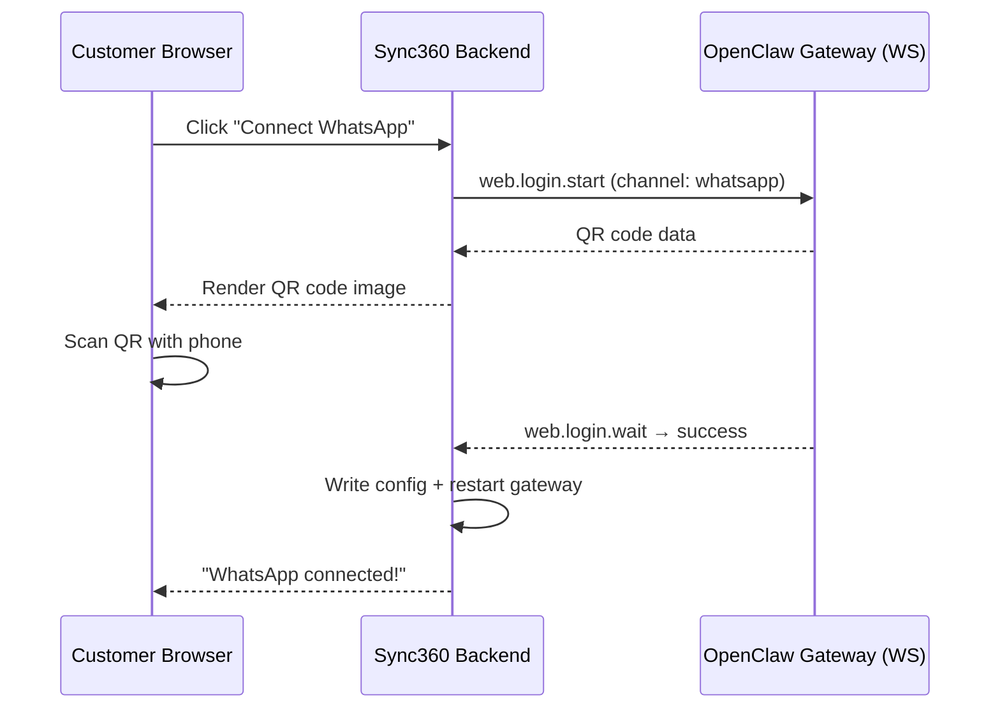

# Managed Channel Connection — Brainstorm

## The Goal

Customers click a button in the Control App, follow a simple visual flow, and their WhatsApp/Telegram channel is connected. They never see a terminal, CLI command, config file, or the word "OpenClaw".

---

## What OpenClaw Actually Needs (Under the Hood)

### Telegram
| What | How |
|---|---|
| Bot token | Written to `openclaw.json` → `channels.telegram.botToken` |
| Access policy | Written to `openclaw.json` → `channels.telegram.dmPolicy`, `allowFrom` |
| Plugin installed | Auto-installed on first gateway start with `--allow-unconfigured` |
| Gateway running | Already running via `compose.yaml` |
| Gateway restart | Needed after config change so it picks up new channel config |

### WhatsApp
| What | How |
|---|---|
| QR code scan | `openclaw channels login --channel whatsapp` generates QR → user scans with phone |
| Session credentials | Stored in the data directory (Baileys auth state) |
| Access policy | Written to `openclaw.json` → `channels.whatsapp.dmPolicy`, `allowFrom` |
| Plugin installed | Auto-installed on first login attempt |
| Gateway running | Already running |
| Gateway restart | Needed after linking |

---

## Feasibility Assessment

### Telegram — ✅ Fully Feasible (Simple)

This is straightforward because it's just config writes + restart:

1. Customer creates bot via @BotFather (they already do this)
2. Customer pastes token in Sync360 UI
3. **Sync360 backend:**
   - Writes `botToken`, `enabled: true`, `dmPolicy: "open"` to `openclaw.json` on the tenant's server (via SSH, same mechanism we already use for `syncRuntime`)
   - Restarts the OpenClaw gateway container: `docker compose restart openclaw-gateway`
4. Done — bot starts receiving messages

> [!TIP]
> This could be live in a few hours. It's literally: write JSON + restart container.

### WhatsApp — ✅ Feasible (More Complex)

OpenClaw's gateway exposes **WebSocket RPC methods** for programmatic channel login:

- `web.login.start` → initiates QR generation
- `web.login.wait` → waits for scan completion

The flow would be:

1. Customer clicks **"Connect WhatsApp"** in the Control App
2. Sync360 backend connects to the tenant's OpenClaw gateway WebSocket (we already know the URL + auth token)
3. Calls `web.login.start` for WhatsApp → receives QR code data
4. Renders QR code in the browser (using a JS QR library like `qrcode.js`)
5. Customer scans QR with their phone (WhatsApp → Linked Devices → Link a Device)
6. Sync360 polls `web.login.wait` → receives success confirmation
7. Sync360 writes access policy to `openclaw.json`
8. Restarts gateway
9. Done — WhatsApp linked



---

## What Changes in the Onboarding Wizard

### Current Flow (Step 5)
```
Select channel → Fill in fields manually → Save → Hope it works
```

### Proposed Flow (Step 5)

#### Telegram
```
Select Telegram → Paste bot token → Click "Connect" 
→ We write config + restart → ✅ Connected
```
Almost identical to current, but the backend actually configures OpenClaw instead of just storing the token in our DB.

#### WhatsApp
```
Select WhatsApp → Click "Connect WhatsApp" 
→ QR code appears in a modal → Scan with phone 
→ ✅ Connected (auto-detected)
```
**No form fields needed** — no Phone Number ID, no Access Token, no Verify Token. The QR scan handles everything.

---

## Architecture Options

### Option A: Sync360 Backend as Proxy (Recommended)

```
Browser ←→ Sync360 Laravel API ←→ OpenClaw Gateway WebSocket
```

- Sync360 backend handles all WS communication
- Browser just sees a simple REST API: `POST /onboarding/channel/whatsapp/link` → returns QR data
- Poll `GET /onboarding/channel/whatsapp/link/status` for completion
- All auth tokens stay server-side (secure)

### Option B: Browser Direct to Gateway

```
Browser ←→ OpenClaw Gateway WebSocket (via CORS)
```

- Browser connects directly to gateway WS
- Simpler but exposes gateway auth token to the browser
- CORS issues if gateway is on a different host

> [!IMPORTANT]
> **Option A is strongly recommended** — keeps gateway credentials server-side and works regardless of network topology (the gateway might be behind a firewall that only the Sync360 server can reach via SSH tunnel).

---

## What We Already Have

| Component | Status |
|---|---|
| Gateway URL per tenant | ✅ `workspace_url` in DB |
| Gateway auth token per tenant | ✅ `OPENCLAW_GATEWAY_TOKEN` in `.env` |
| SSH to remote server | ✅ `DockerComposeRunner` service |
| Config file writes | ✅ `TenantAgentSyncService` already writes workspace files |
| Container restart | ✅ `DockerComposeRunner::up()` already does this |

---

## Open Questions

> [!WARNING]
> These need your input before we proceed:

1. **WhatsApp: Should we support it in V1?** The QR code flow is cool but more complex. We could ship Telegram first (simple) and add WhatsApp QR in V2.

2. **Access policy: Open by default?** For a managed service, should all incoming DMs be accepted (`dmPolicy: "open"`)? Or should we default to `"pairing"` and auto-approve? Open is simpler for customers.

3. **Gateway restart strategy:** When we write config + restart, the gateway drops briefly (< 5 seconds). Is this acceptable? Alternative: some config changes can be hot-reloaded via the WS API.

4. **WhatsApp phone number:** With the QR flow, we don't need the customer to type their phone number — it's auto-detected during linking. Should we still collect it for display/records, or just show it after linking?

5. **Onboarding step order:** Currently channel is Step 5 (before Go Live). With managed connection, should Step 5 become just "Connect" with a single button per channel, or keep the current layout?

---

## Proposed Phased Approach

### Phase 1: Telegram (Ship Now)
- Customer pastes bot token → Sync360 writes to `openclaw.json` → restarts gateway
- ~2-3 hours of work
- Form stays similar but backend actually configures OpenClaw

### Phase 2: WhatsApp QR (Ship Next)
- "Connect WhatsApp" button → QR modal → scan → done
- ~1-2 days of work
- Needs: WS client in PHP/Laravel, QR rendering in frontend, polling endpoint

### Phase 3: Status Monitoring
- Show real-time channel health on dashboard (connected/disconnected)
- Reconnection alerts
- WhatsApp session expiry detection
